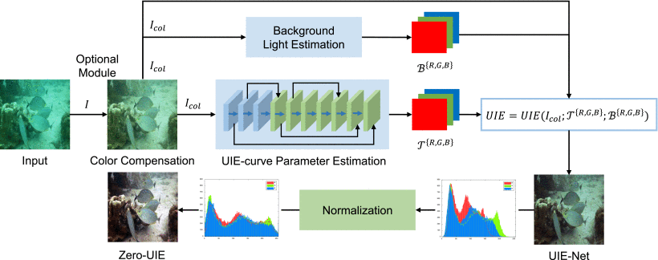








I am now working on **underwater information perception and processing research**. I am currently an Assistant Professor at the School of Information and Communication Engineering, [Guilin University of Electronic Technology (桂林电子科技大学)](https://www.guet.edu.cn/). If you are interested in any form of academic cooperation, please feel free to contact me at <yfhuang@guet.edu.cn>. I will be recruiting master's students!

I earned my Ph.D. in **Key Laboratory of Underwater Acoustic Communication and Marine Information Technology, Ministry of Education**, [Xiamen University (厦门大学)](https://www.xmu.edu.cn/), under the guidance of Professors [Cheng En (程恩)](https://informatics.xmu.edu.cn/old/info/1021/46130.htm) and [Yuan Fei (袁飞)](https://informatics.xmu.edu.cn/old/info/1021/24079.htm). My postdoctoral co-supervisor is **Chen Feng (陈峰)** (Ph.D. from Harbin Engineering University). My research focuses on underwater information acquisition, underwater intelligent perception, and computation. I specialize in areas such as underwater physical imaging modeling, underwater image enhancement, underwater target detection, and polarization-based visual information perception. My work has yielded multiple research outcomes, including innovative contributions such as an underwater imaging curve reconstruction model, light attenuation compensation and multi-scale fusion enhancement algorithms, and underwater polarization-based clear imaging techniques, all of which significantly improve imaging quality and visual performance in complex aquatic environments.

On the topic of underwater visual reconstruction and image processing, I have published over 10 papers in authoritative international and domestic journals, including **_IEEE Journal of Oceanic Engineering_** and **_Signal Processing-Image Communication_**, etc. I have led research project funded by the China Postdoctoral Science Foundation.

I am a reviewer for **_IEEE Transactions on Circuits and Systems for Video Technology_** and **_IEEE Signal Processing Letters_**.

# 🔥 News
- *2025.12*: &nbsp;🎉🎉 I award a grant from the China Postdoctoral Science Foundation!
- *2025.05*: &nbsp;🎉🎉 One paper is accepted by _Journal of Real-Time Image Processing_!
- *2025.02*: &nbsp;🎉🎉 One paper is accepted by _IEEE Journal of Oceanic Engineering_!
- *2024.10*: &nbsp;🎉🎉 One paper is accepted by _IEEE Transactions on Geoscience and Remote Sensing_!
- *2024.03*: &nbsp;🎉🎉 One paper is accepted by _Remote Sensing_!
- *2023.04*: &nbsp;🎉🎉 One paper is accepted by _IEEE Journal of Oceanic Engineering_!

# 📝 Publications 

-[Underwater Image Enhancement Based on Zero-Reference Deep Network](https://ieeexplore.ieee.org/abstract/document/10091685), **Yifan Huang**, Fei Yuan, Fengqi Xiao, Jianxiang Lu, En Cheng, **IEEE Journal of Oceanic Engineering 2023**

- [Lorem ipsum dolor sit amet, consectetur adipiscing elit. Vivamus ornare aliquet ipsum, ac tempus justo dapibus sit amet](https://github.com), A, B, C, **CVPR 2020**

# 📖 Educations
- *2020.09 - 2024.12*, PhD, Key Laboratory of Underwater Acoustic Communication and Marine Information Technology, Ministry of Education, Xiamen University. 
- *2017.09 - 2020.06*, Master, Key Laboratory of Underwater Acoustic Communication and Marine Information Technology, Ministry of Education, Xiamen University.
- *2012.09 - 2016.06*, Undergraduate, School of Information, Xiamen University.

# 💬 Lectures and Forums
- *2025.11*, "桂电论坛：通识教育讲座计划", 水下智能感知与科研探索之旅. 
- *2023.06*, "第六届全国海洋光学技术交流会优秀学生报告", 基于零参考深度网络的水下图像增强. 

# 🎖 Honors and Awards
- *2021.10* Lorem ipsum dolor sit amet, consectetur adipiscing elit. Vivamus ornare aliquet ipsum, ac tempus justo dapibus sit amet. 
- *2021.09* Lorem ipsum dolor sit amet, consectetur adipiscing elit. Vivamus ornare aliquet ipsum, ac tempus justo dapibus sit amet. 
# 💻 Internships
- *2019.05 - 2020.02*, [Lorem](https://github.com/), China.
